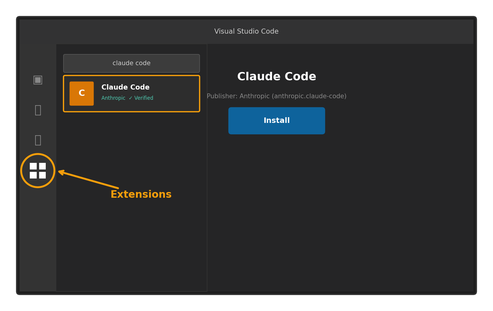
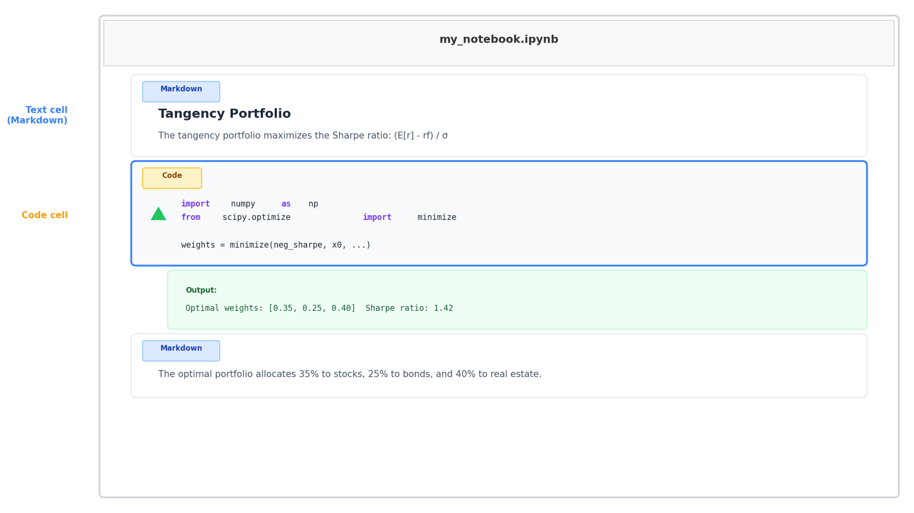
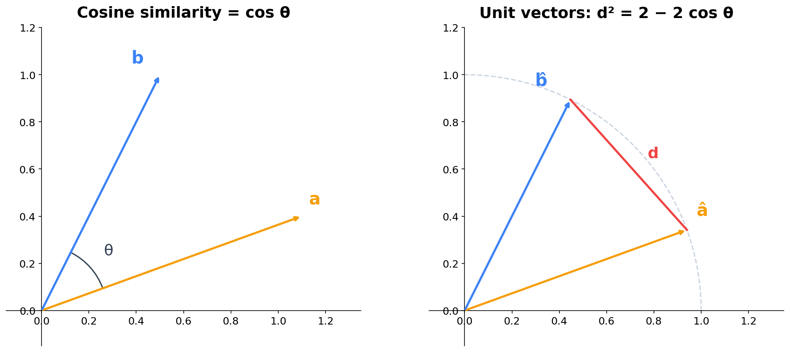
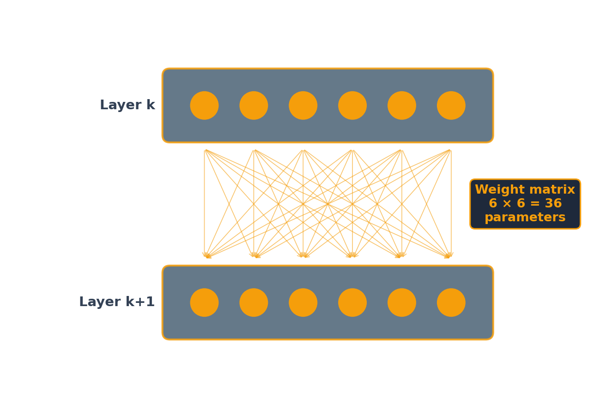
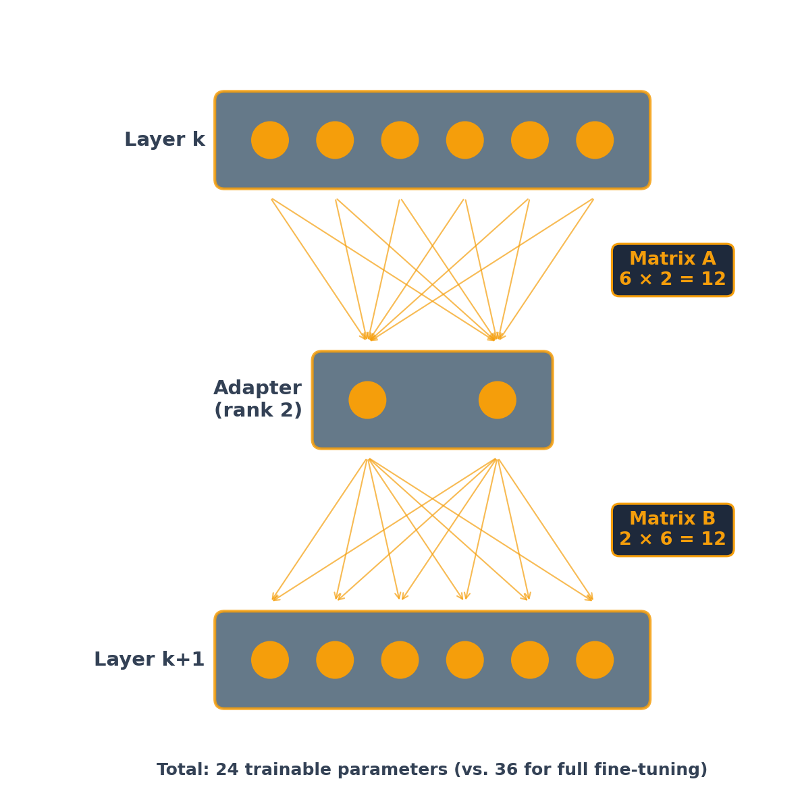

## What is Fine-Tuning?

A pretrained LLM already knows language. **Fine-tuning** adjusts its weights on a smaller, task-specific dataset so it consistently performs a specific task the way you want:

- Adopt a specific tone or format (e.g., always respond as a financial analyst)
- Learn domain terminology and conventions
- Follow company-specific rules and workflows

:::{.explainer}
Analogy: a pretrained model is like hiring a smart generalist. Fine-tuning is [specialized on-the-job training]{.amber}.
:::

## Fine-Tuning vs. Prompting vs. RAG

:::{.three-cards}
:::{.card .card-light}
[**Prompting / Skills**]{.card-title}

- Change behavior via instructions
- No training required
- Limited by context window
- Easy to iterate
:::

:::{.card .card-light}
[**RAG**]{.card-title}

- Inject external knowledge at query time
- No model weights changed
- Answers grounded in retrieved documents
- Great for factual Q&A
:::

:::{.card .card-dark}
[**Fine-Tuning**]{.card-title}

- Change the model's weights
- Learns patterns, tone, and format
- Knowledge baked into the model
- Best for consistent, specialized behavior
:::
:::

## When to Fine-Tune

Fine-tuning is **not** the right tool when:

- Your data changes frequently (use RAG instead)
- You need answers from specific documents (use RAG)
- A well-crafted prompt already works (keep it simple)

Fine-tuning is worth the effort when:

- You need [consistent behavior]{.amber} across thousands of queries (not one-off tasks)
- Prompting alone can't capture the nuance (complex formatting, domain jargon, regulatory style)
- You want lower latency and cost than a large model with a long system prompt
- You have (or can generate) high-quality training examples

## Distillation: A Powerful Pattern

One compelling use case for fine-tuning: use a large model to [generate training data]{.amber}, then fine-tune a smaller model on it.

:::{.three-cards}
:::{.card .card-dark}
[**Cost**]{.card-title}

Large models cost 10--30x more per query

Generate training data once, then run the small model at a [fraction of the cost]{.amber}
:::

:::{.card .card-dark}
[**Speed**]{.card-title}

A fine-tuned small model responds in milliseconds for classification, seconds for generation

Large API models are 10--50x slower
:::

:::{.card .card-dark}
[**Privacy**]{.card-title}

A fine-tuned small model runs [entirely on your infrastructure]{.amber}

No data leaves your network (HIPAA, GDPR)
:::
:::

## Distillation in Practice

Well-known examples of LLM → small model distillation:

- [**Stanford Alpaca**](https://crfm.stanford.edu/2023/03/13/alpaca.html){target="_blank"}: GPT-3.5 → LLaMA 7B. API cost < $600. Competitive on simple instruction-following, weaker on reasoning.
- [**Microsoft Orca**](https://www.microsoft.com/en-us/research/blog/orca-2-teaching-small-language-models-how-to-reason/){target="_blank"}: GPT-4's detailed [reasoning traces]{.amber} (not just answers) → smaller model. Capturing the teacher's thinking process improves quality.
- [**Microsoft Phi**](https://www.microsoft.com/en-us/research/blog/phi-2-the-surprising-power-of-small-language-models/){target="_blank"}: LLM-generated "textbook quality" synthetic data → 1.3B--3B parameter models that match much larger models on reasoning benchmarks.

:::{.explainer}
The pattern works best for [specific, repeatable tasks at scale]{.amber}: classify emails, extract fields, generate reports. For diverse, one-off tasks, just use the LLM directly.
:::

## The Fine-Tuning Process {.section-divider}

## Collect Training Data

Training data is a set of **input/output pairs** --- examples of what you want the model to do.

| **Input** | **Output** |
|---|---|
| "Summarize this 10-K risk factor..." | "The company faces supply chain risk due to..." |
| "Classify this earnings call sentence..." | "Positive guidance" |
| "Write a credit memo for..." | "Credit Assessment: BBB+ ..." |

:::{.explainer}
Start small --- behavioral changes can appear with as few as [20 examples]{.amber}. Meta's LIMA project showed strong results with just 1,000 carefully curated examples. [Quality matters more than quantity]{.amber}.
:::

## What Can Go Wrong?

Fine-tuning is not risk-free. Issues to watch for:

- **Catastrophic forgetting**: the model loses general capabilities it had before fine-tuning (e.g., it classifies sentiment perfectly but can no longer summarize)
- **Overfitting**: with too few examples, the model memorizes training data instead of learning patterns --- performs great on training-like inputs, fails on anything different
- **Maintenance burden**: when the base model gets a new version, you may need to re-fine-tune

## Claude {.section-divider}

## Claude Desktop

Claude Desktop has three modes: [Chat]{.amber}, [Cowork]{.amber}, and [Code]{.amber}. In all three, prompts go to and responses come from the cloud. The modes differ in [where Python execution happens]{.amber}.

- [**Chat**]{.amber}: Python runs on Anthropic's servers. Only libraries pre-installed by Anthropic. No internet access from Python (sandboxed).
- [**Cowork**]{.amber}: Python runs on your computer. Any libraries you want. No internet access from Python (sandboxed).
- [**Code**]{.amber}: Python runs on your computer. Any libraries you want. Internet available.

:::{.explainer}
Code mode is the most powerful but also the most permissive --- Claude can read/write files, run shell commands, and access the internet. Use it when you need full control; use Chat or Cowork for safer exploration.
:::

## VS Code (Visual Studio Code)

Download VS Code from [code.visualstudio.com](https://code.visualstudio.com){target="_blank"}. Install and open it.

{fig-align="center" width="65%" .nostretch}

:::{.explainer}
Click the [Extensions icon]{.amber} in the left sidebar (four squares), search for **"claude code"**, and install the one published by **Anthropic** (look for the verified checkmark). The extension ID is `anthropic.claude-code`.
:::

## Using Claude Code in VS Code

1. Click the [Claude icon]{.amber} in the left activity bar to open the Claude Code panel
2. Click [**+ New Session**]{.amber} to start a conversation
3. You can open [multiple sessions]{.amber} to work on different tasks in parallel

:::{.explainer}
You can also open Claude Code from the command palette: press `Ctrl+Shift+P` (or `Cmd+Shift+P` on Mac) and type "Claude".
:::

## Try It: A Single Prompt, Three Files

Ask Claude Code:

> *Calculate and plot the P/E ratios of the Magnificent 7 stocks over the past 3 years. Save the chart as a PNG. Write a Word document ranking the stocks by current P/E with a brief investment commentary.*

Claude will create:

- A [**Python script**]{.amber} (`.py`) that fetches data, computes ratios, and generates the outputs
- A [**chart**]{.amber} (`.png`) visualizing P/E ratios over time
- A [**Word document**]{.amber} (`.docx`) with analysis and commentary

:::{.explainer}
This is a good test of Claude Code's capabilities. If something doesn't work, just tell Claude what went wrong --- it will read the error and fix it.
:::

## Slash Commands

:::{style="font-size: 0.82em;"}
Type `/` in Claude Code to see all available commands. The most useful:

- [**/resume**]{.amber} --- resume a previous conversation by name or ID, picking up where you left off
- [**/rewind**]{.amber} --- undo Claude's code changes and revert the conversation to an earlier point
- [**/btw**]{.amber} --- ask a quick side question without adding it to the conversation history
- [**/diff**]{.amber} --- open an interactive diff viewer to review all uncommitted changes
- [**/plan**]{.amber} --- enter read-only planning mode so Claude designs a strategy before making changes
- [**/model**]{.amber} --- switch models on the fly (e.g., from Sonnet to Opus for harder tasks)
- [**/cost**]{.amber} --- check real-time token usage and spending
:::

:::{.explainer}
If you install (or ask Claude to install) the **critique** skill, you can prompt `/critique filename` to get a multi-perspective review of your work.
:::

## Jupyter Notebooks and Colab {.section-divider}

## Jupyter Notebooks

A Jupyter notebook (`.ipynb`) is a document with two types of cells:

- [**Code cells**]{.amber} --- write and run Python (or R, Julia, etc.). Output appears directly below the cell.
- [**Text cells**]{.amber} --- written in [Markdown]{.amber}, a simple formatting language. Use `# Heading`, `**bold**`, `*italic*`, bullet lists, LaTeX math (`$E[r]$`), etc.

{fig-align="center" width="70%" .nostretch}

## Google Colab

[Google Colab](https://colab.research.google.com){target="_blank"} is a free, cloud-hosted Jupyter notebook environment --- no installation required.

- Access via your browser, notebooks are saved to Google Drive
- Free access to GPUs and TPUs for machine learning
- Can install whatever libraries you want
- Share notebooks like Google Docs

[**Gemini in Colab**]{.amber}: Google's AI assistant is built into Colab. It can generate code, explain errors, and autocomplete --- similar to Claude Code but inside the notebook.

:::{.explainer}
Colab is ideal for quick experiments and for running code that needs a GPU (e.g., fine-tuning). For longer projects with many files, VS Code + Claude Code is more powerful.
:::

## VS Code

:::{style="font-size: 0.85em;"}
To work with Jupyter notebooks locally in VS Code:

1. Open [Extensions]{.amber} (four squares icon) and install:
   - **Python** (by Microsoft) --- Python language support
   - **Jupyter** (by Microsoft) --- notebook support in VS Code
2. Create a new file with the `.ipynb` extension, or open an existing notebook

Then ask Claude Code:

> *Generate a Jupyter notebook with text and code cells explaining how to calculate the tangency portfolio when there are no short sales constraints.*

Claude will create the `.ipynb` file with explanatory markdown cells and working Python code.
:::

## Python Workshop

For a hands-on introduction to Python for finance, visit:

:::{style="font-size: 1.2em; text-align: center; margin-top: 1em;"}
[**workshop.kerryback.com**](https://workshop.kerryback.com){target="_blank"}
:::

## Cosine Similarity {.section-divider}

## Cosine Similarity vs. Distance

:::{style="font-size: 0.75em;"}
The [cosine similarity]{.amber} between two vectors is the cosine of the angle between them. It measures direction, not magnitude.

{fig-align="center" width="65%" .nostretch}

If we normalize vectors to [unit length]{.amber} (project them onto the unit circle), the squared Euclidean distance between them is:

$$d^2 = 2 - 2\cos\theta$$

So [high cosine similarity]{.amber} $\Leftrightarrow$ small angle $\Leftrightarrow$ normalized vectors are [close together]{.amber}.
:::


## Biases and Weights {.section-divider}

## A Simple Neural Network {.mermaid-small}

```{mermaid}
%%| fig-width: 16
%%{init: {'theme': 'base', 'themeVariables': {'fontSize': '36px', 'primaryColor': '#f59e0b', 'primaryTextColor': '#0f172a', 'lineColor': '#f59e0b', 'clusterBkg': 'transparent', 'clusterBorder': '#f59e0b', 'clusterTextColor': '#fff'}, 'flowchart': {'nodeSpacing': 80, 'rankSpacing': 140, 'padding': 20, 'useMaxWidth': true}}}%%
graph LR
  subgraph Inputs[" "]
    direction TB
    X1(("x₁"))
    X2(("x₂"))
    X3(("x₃"))
  end
  subgraph Hidden["Hidden Layer"]
    direction TB
    H1(("y₁"))
    H2(("y₂"))
  end
  subgraph Output[" "]
    direction TB
    Y(("z"))
  end
  X1 --> H1 & H2
  X2 --> H1 & H2
  X3 --> H1 & H2
  H1 --> Y
  H2 --> Y

  style X1 fill:#3b82f6,stroke:#3b82f6,color:#fff
  style X2 fill:#3b82f6,stroke:#3b82f6,color:#fff
  style X3 fill:#3b82f6,stroke:#3b82f6,color:#fff
  style H1 fill:#f59e0b,stroke:#f59e0b,color:#fff
  style H2 fill:#f59e0b,stroke:#f59e0b,color:#fff
  style Y fill:#0f172a,stroke:#0f172a,color:#fff
  linkStyle default stroke:#334155,stroke-width:2px
```

A **fully connected** network: every input connects to every neuron in the next layer.

## How a Neuron Decides

Each neuron in the hidden layer computes a [weighted sum]{.amber} of its inputs plus a bias:

$$\hat{y} = b + w_1 x_1 + w_2 x_2 + w_3 x_3$$

The neuron "fires" (produces a nonzero output) only if this sum is positive:

- The [weights]{.amber} $w_1, w_2, w_3$ determine [which inputs matter and how much]{.amber}
- The [bias]{.amber} $b$ sets the [threshold]{.amber} --- how large the weighted inputs must be before the neuron activates

:::{.explainer}
If the weights are positive, the neuron fires when the inputs are large enough. The bias $b$ controls [how large]{.amber} --- a more negative bias means the inputs must be stronger to activate the neuron. Training a neural network means finding the right weights and biases.
:::

## LoRA: Low-Rank Adaptation {.section-divider}

## Full Fine-Tuning vs. LoRA

:::{.two-cards}
:::{.card .card-light}
[**Full Fine-Tuning**]{.card-title}

- Update **all** model parameters
- Maximum flexibility
- Requires significant GPU memory and compute
- Produces a full copy of the model
:::
:::{.card .card-dark}
[**LoRA (Parameter-Efficient)**]{.card-title}

- Freeze the original weights
- Train only small adapter matrices
- ~100x fewer trainable parameters
- Comparable quality on most tasks, fraction of the cost
:::
:::

:::{.explainer}
In practice, almost everyone uses [LoRA]{.amber} or a similar parameter-efficient method. Full fine-tuning is reserved for large-budget projects.
:::

## How LoRA Works

The LoRA paper (Hu et al., 2021) observed that the changes needed to adapt a model to a new task are surprisingly simple --- they can be captured with a [small number of parameters]{.amber}.

Instead of updating an entire weight matrix, LoRA decomposes the update into two small matrices. Only these small matrices are trained; the original weights are frozen.

:::{.two-cards}
:::{.card .card-light}
[**Full Fine-Tuning**]{.card-title}

- Update millions of parameters per layer
- Example: a 4096 × 4096 layer has **16.8 million** parameters
- Full copy of model weights
:::

:::{.card .card-dark}
[**LoRA (rank 16)**]{.card-title}

- Update only ~131,000 parameters per layer
- [128x reduction]{.amber}
- Adapter files are just MBs, not GBs
- At deployment, merge adapters into the base weights --- [no latency penalty]{.amber}
:::
:::

## Original Model

{fig-align="center" width="55%" .nostretch}

:::{.explainer}
Each of the 6 nodes in layer k+1 receives input from all 6 nodes in layer k, so the [weight matrix]{.amber} has 6 × 6 = [36 coefficients]{.amber}. Each node also has a [bias]{.amber}, adding 6 more parameters --- [42 total]{.amber} per layer. Full fine-tuning means retraining all 42.
:::

## LoRA (Rank 2): Low-Rank Update Path

{fig-align="center" width="42%" .nostretch}

:::{.explainer}
The original 36 direct connections remain active but [frozen]{.amber} (not shown). At real scale (4096 × 4096 layers, rank 16): [131K vs. 16.8M]{.amber} trainable parameters --- a 128× reduction.
:::

## LoRA: The Math

LoRA trains two small matrices per layer. The adapter path is [purely linear]{.amber} --- no activation function in between:

:::{style="font-size: 0.85em;"}

- Matrix **A** has dimensions [rank × input size]{.amber} (compresses down)
- Matrix **B** has dimensions [output size × rank]{.amber} (expands back up)
- The product $B \times A$ has the [same dimensions]{.amber} as the original weight matrix $W$

:::

At inference, merge the adapter into the original weights:

$$W' = W + B \times A$$

:::{.explainer}
Because the adapter path is linear (just two matrix multiplications, no activation function), the product $B \times A$ is itself a matrix that can be added directly to $W$. The merged model has the [same architecture and speed]{.amber} as the original --- the adapter disappears into the weights.
:::

## QLoRA: Fine-Tune on a Free GPU

**QLoRA** (Dettmers et al., 2023) adds 4-bit quantization on top of LoRA:

- Compress base model weights to [4-bit precision]{.amber} (from 16-bit) --- 4x memory savings
- Train LoRA adapters on top of the quantized model
- Quality is comparable to full-precision LoRA

:::{.explainer}
Result: fine-tune a **70B-parameter model on a single 48GB GPU**. For smaller models like Gemma 1B, QLoRA makes fine-tuning possible on a [free Colab T4]{.amber} (16GB).
:::

## Hands-On: Fine-Tuning with LoRA

Fine-tune **Google Gemma 3 1B** to classify financial news sentiment using QLoRA --- in a Colab notebook.

:::{.two-cards}
:::{.card .card-light}
[**What You'll Do**]{.card-title}

- Load Gemma 1B with 4-bit quantization
- Attach LoRA adapters (< 0.1% of parameters)
- Train on 4,845 expert-labeled financial sentences
- Test on new examples
:::

:::{.card .card-dark}
[**What You'll Need**]{.card-title}

- Google Colab with T4 GPU (free tier)
- A Hugging Face account and access token
- Accept Google's Gemma license
- ~15 minutes to train
:::
:::

<a href="https://colab.research.google.com/github/kerryback/mgmt675/blob/main/files/fine-tuning-gemma.ipynb" target="_blank" style="display: inline-block; margin-top: 0.5em; padding: 0.5em 1.2em; background: #f59e0b; color: #fff; border-radius: 8px; font-weight: 700; font-size: 0.9em; text-decoration: none;">Open in Google Colab →</a>
