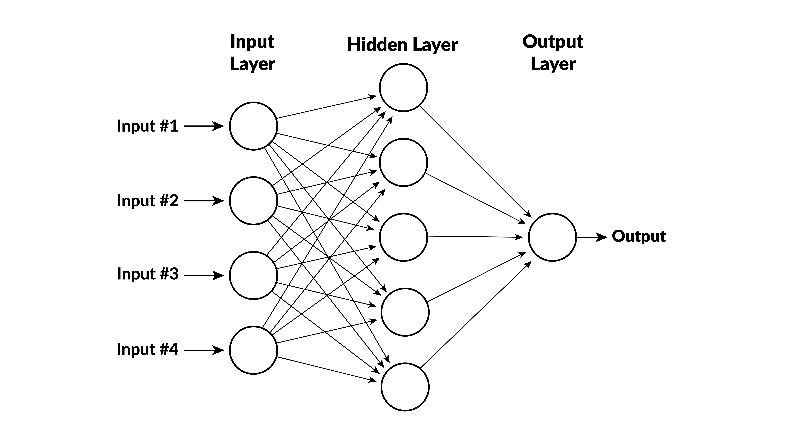

## What Is Predictive Modeling?

Use [historical data]{.amber} to learn a function $f$ that maps features $X$ to a target $y$.

$$y \approx f(X)$$

:::{.two-cards}
:::{.card .card-light}
[**Regression**]{.card-title}

- Target is a continuous number
- Example: predict house prices
- Measure error with MSE, $R^2$
:::

:::{.card .card-light}
[**Classification**]{.card-title}

- Target is a category (0 or 1, etc.)
- Example: predict loan default
- Measure with accuracy, AUC
:::
:::

## Linear Regression as a Prediction Model

The simplest $f$: a weighted sum of features.

$$\hat{y} = \beta_0 + \beta_1 x_1 + \beta_2 x_2 + \cdots + \beta_p x_p$$

- Fit by minimizing [sum of squared errors]{.amber} on training data
- Fast, interpretable, strong baseline
- Works well when the true relationship is approximately linear

:::{.explainer}
You already know linear regression from statistics.  The new idea is to use it as a [prediction machine]{.amber}: fit on known data, then predict for new observations.
:::

## Linear Regression in scikit-learn

```python
from sklearn.linear_model import LinearRegression
import numpy as np

# X is an n×p array of features, y is an n-vector of targets
model = LinearRegression()
model.fit(X, y)

# Predict for a single new observation (1×p array)
new_obs = np.array([[feature1, feature2, ..., featurep]])
prediction = model.predict(new_obs)
print(f"Predicted value: {prediction[0]:.2f}")
```

:::{.explainer}
Three steps: (1) create the model, (2) `fit` on data, (3) `predict` for new inputs.  Every scikit-learn model follows this same pattern.
:::

## Beyond Linear Models {.section-divider}

## Categories of Nonlinear Models

:::{.four-cards}
:::{.card .card-light}
[**Tree-Based**]{.card-title}

- Decision trees
- Random forests
- Gradient boosting
:::

:::{.card .card-light}
[**Neural Networks**]{.card-title}

- Feedforward nets
- Deep learning
- Transformers (LLMs!)
:::

:::{.card .card-light}
[**Kernel Methods**]{.card-title}

- Support vector machines
- Gaussian processes
:::

:::{.card .card-light}
[**Other**]{.card-title}

- K-nearest neighbors
- Naive Bayes
- Ensemble methods
:::
:::

:::{.explainer}
We'll focus on [gradient boosting]{.amber} --- it dominates structured/tabular data tasks and is the most widely used ML method in finance.
:::

## What Is Gradient Boosting?

Build a prediction by [adding many small decision trees]{.amber}, each one correcting the errors of the previous ensemble.

:::{.info-box}
[**The Intuition**]{.box-title}

1. Fit a simple tree to the data
2. Compute the [residuals]{.amber} (errors)
3. Fit the next tree to predict the residuals
4. Add the new tree's predictions (scaled down) to the running total
5. Repeat for hundreds of rounds
:::

:::{.explainer}
Each tree is weak on its own, but the ensemble is powerful.  The "gradient" part means we follow the gradient of the loss function --- like gradient descent, but in function space.
:::

## Gradient Boosting in scikit-learn

```python
from sklearn.ensemble import GradientBoostingRegressor

model = GradientBoostingRegressor(
    n_estimators=500,     # number of trees
    max_depth=4,          # depth of each tree
    learning_rate=0.05,   # shrinkage factor
)
model.fit(X, y)

prediction = model.predict(new_obs)
```

:::{.explainer}
Same `fit` / `predict` interface.  The key hyperparameters are the number of trees, depth, and learning rate.
:::

## Regression Example: California Housing {.section-divider}

## The Dataset

Predict [median house value]{.amber} for California census block groups.

| Feature | Description |
|---------|-------------|
| MedInc | Median income in block group |
| HouseAge | Median house age |
| AveRooms | Average number of rooms |
| AveBedrms | Average number of bedrooms |
| Population | Block group population |
| AveOccup | Average household size |
| Latitude | Block group latitude |
| Longitude | Block group longitude |

Download: [california-housing.csv](../files/california-housing.csv) (20,640 observations)

## Load and Inspect

```python
import pandas as pd

df = pd.read_csv("files/california-housing.csv")
X = df.drop(columns="MedHouseVal")
y = df["MedHouseVal"]

print(f"Features: {X.shape[1]}, Observations: {X.shape[0]}")
print(X.describe().round(2))
```

:::{.explainer}
`MedHouseVal` is the target (in $100,000s).  The 8 remaining columns are features.
:::

## Fit Both Models

```python
from sklearn.linear_model import LinearRegression
from sklearn.ensemble import GradientBoostingRegressor

# Linear regression
lr = LinearRegression().fit(X, y)

# Gradient boosting
gb = GradientBoostingRegressor(
    n_estimators=500, max_depth=4, learning_rate=0.05
).fit(X, y)
```

## Predict for a New Observation

```python
import numpy as np

# A hypothetical census block group
new_obs = np.array([[4.5, 30, 5.5, 1.1, 1200, 3.0, 34.0, -118.5]])

lr_pred = lr.predict(new_obs)[0]
gb_pred = gb.predict(new_obs)[0]

print(f"Linear regression: ${lr_pred * 100_000:,.0f}")
print(f"Gradient boosting: ${gb_pred * 100_000:,.0f}")
```

:::{.explainer}
Both models produce a prediction, but which one should we trust?  We need a principled way to [compare]{.amber} them.
:::

## Which Model Is Better? {.section-divider}

## The Problem with Training Error

If we measure error on the [same data we used to fit]{.amber}, a more complex model will always look better.

- It can memorize the training data (overfitting)
- Training error is an [optimistic]{.amber} estimate of true prediction quality
- We need to test on data the model [has never seen]{.amber}

## Train/Test Split

:::{.info-box}
[**The Solution**]{.box-title}

1. Randomly split the data into [training]{.amber} (e.g., 80%) and [test]{.amber} (20%) sets
2. Fit both models on the training set only
3. Evaluate predictions on the held-out test set
4. The model with lower test error generalizes better
:::

```python
from sklearn.model_selection import train_test_split

X_train, X_test, y_train, y_test = train_test_split(
    X, y, test_size=0.2, random_state=42
)
print(f"Train: {X_train.shape[0]}, Test: {X_test.shape[0]}")
```

## Evaluate on the Test Set

```python
from sklearn.metrics import mean_squared_error, r2_score

# Fit on training data
lr = LinearRegression().fit(X_train, y_train)
gb = GradientBoostingRegressor(
    n_estimators=500, max_depth=4, learning_rate=0.05
).fit(X_train, y_train)

# Predict on test data
lr_pred = lr.predict(X_test)
gb_pred = gb.predict(X_test)
```

## Compare Results

```python
print("Linear Regression:")
print(f"  RMSE = {mean_squared_error(y_test, lr_pred, squared=False):.3f}")
print(f"  R²   = {r2_score(y_test, lr_pred):.3f}")
print()
print("Gradient Boosting:")
print(f"  RMSE = {mean_squared_error(y_test, gb_pred, squared=False):.3f}")
print(f"  R²   = {r2_score(y_test, gb_pred):.3f}")
```

:::{.explainer}
RMSE is in the same units as the target ($100k).  $R^2$ is the fraction of variance explained.  [Lower RMSE and higher $R^2$ on the test set]{.amber} = better generalization.
:::

## Typical Results

| Metric | Linear Regression | Gradient Boosting |
|--------|:-----------------:|:-----------------:|
| Test RMSE | ~0.73 | ~0.53 |
| Test $R^2$ | ~0.58 | ~0.78 |

:::{.explainer}
Gradient boosting captures [nonlinear patterns]{.amber} --- interactions between location, income, and housing characteristics --- that linear regression misses.
:::

## Classification {.section-divider}

## From Regression to Classification

When the target is [binary]{.amber} (0 or 1), we need classification models.

:::{.two-cards}
:::{.card .card-light}
[**Logistic Regression**]{.card-title}

- Linear model, but outputs a [probability]{.amber} via the sigmoid function
- $P(y=1) = \frac{1}{1 + e^{-(\beta_0 + \beta_1 x_1 + \cdots)}}$
- Classify as 1 if $P > 0.5$, else 0
:::

:::{.card .card-light}
[**Gradient Boosting Classifier**]{.card-title}

- Same boosting idea, but optimizes [log-loss]{.amber} (cross-entropy)
- Uses softmax to convert raw scores to probabilities
- Handles nonlinear decision boundaries
:::
:::

## Logistic Regression in scikit-learn

```python
from sklearn.linear_model import LogisticRegression

model = LogisticRegression(max_iter=10000)
model.fit(X_train, y_train)

# Predict class labels
y_pred = model.predict(X_test)

# Predict probabilities
y_prob = model.predict_proba(X_test)[:, 1]  # P(class = 1)
```

:::{.explainer}
Same `fit`/`predict` pattern.  Use `predict_proba` to get probabilities instead of hard class labels.
:::

## Gradient Boosting for Classification

```python
from sklearn.ensemble import GradientBoostingClassifier

model = GradientBoostingClassifier(
    n_estimators=300,
    max_depth=3,
    learning_rate=0.1,
)
model.fit(X_train, y_train)

y_pred = model.predict(X_test)
y_prob = model.predict_proba(X_test)[:, 1]
```

:::{.explainer}
The classifier version automatically uses log-loss and softmax internally.  The API is identical to the regressor.
:::

## Classification Example: Breast Cancer {.section-divider}

## The Dataset

Predict whether a tumor is [malignant (0) or benign (1)]{.amber} from cell nucleus measurements.

- 569 observations, 30 features
- Features: radius, texture, perimeter, area, smoothness, etc.
- Each measured as mean, standard error, and worst (largest) value

Download: [breast-cancer.csv](../files/breast-cancer.csv)

:::{.explainer}
This is a classic ML benchmark.  In finance, the same methods apply to credit default, fraud detection, and churn prediction.
:::

## Load and Split

```python
import pandas as pd
from sklearn.model_selection import train_test_split

df = pd.read_csv("files/breast-cancer.csv")
X = df.drop(columns="target")
y = df["target"]

X_train, X_test, y_train, y_test = train_test_split(
    X, y, test_size=0.2, random_state=42
)
print(f"Train: {X_train.shape[0]}, Test: {X_test.shape[0]}")
print(f"Class balance: {y_train.value_counts().to_dict()}")
```

## Fit Both Classifiers

```python
from sklearn.linear_model import LogisticRegression
from sklearn.ensemble import GradientBoostingClassifier

# Logistic regression
logit = LogisticRegression(max_iter=10000).fit(X_train, y_train)

# Gradient boosting
gbc = GradientBoostingClassifier(
    n_estimators=300, max_depth=3, learning_rate=0.1
).fit(X_train, y_train)
```

## Confusion Matrix

A confusion matrix shows counts of correct and incorrect predictions.

```python
from sklearn.metrics import confusion_matrix, ConfusionMatrixDisplay
import matplotlib.pyplot as plt

fig, axes = plt.subplots(1, 2, figsize=(12, 4))

for ax, model, name in [
    (axes[0], logit, "Logistic Regression"),
    (axes[1], gbc, "Gradient Boosting"),
]:
    cm = confusion_matrix(y_test, model.predict(X_test))
    ConfusionMatrixDisplay(cm, display_labels=["Malignant", "Benign"]).plot(ax=ax)
    ax.set_title(name)

plt.tight_layout()
plt.savefig("files/confusion-matrices.png", dpi=150)
plt.show()
```

## Reading a Confusion Matrix

|  | Predicted Malignant | Predicted Benign |
|--|:---:|:---:|
| **Actually Malignant** | True Negative | [False Positive]{.amber} |
| **Actually Benign** | [False Negative]{.amber} | True Positive |

- [False positives]{.amber}: predicted benign but actually malignant (dangerous!)
- [False negatives]{.amber}: predicted malignant but actually benign (unnecessary worry)
- Overall accuracy = (TP + TN) / total

## ROC Curves and AUC

The ROC curve plots [true positive rate vs. false positive rate]{.amber} at every probability threshold.

```python
from sklearn.metrics import roc_curve, auc
import matplotlib.pyplot as plt

fig, ax = plt.subplots(figsize=(7, 6))

for model, name in [(logit, "Logistic Regression"), (gbc, "Gradient Boosting")]:
    y_prob = model.predict_proba(X_test)[:, 1]
    fpr, tpr, _ = roc_curve(y_test, y_prob)
    ax.plot(fpr, tpr, label=f"{name} (AUC = {auc(fpr, tpr):.3f})")

ax.plot([0, 1], [0, 1], "k--", label="Random (AUC = 0.500)")
ax.set_xlabel("False Positive Rate")
ax.set_ylabel("True Positive Rate")
ax.set_title("ROC Curves")
ax.legend()
plt.savefig("files/roc-curves.png", dpi=150)
plt.show()
```

## Interpreting AUC

- **AUC = 0.5**: model is no better than random guessing
- **AUC = 1.0**: model is perfect
- **AUC > 0.9**: excellent discrimination

:::{.info-box}
[**AUC in Finance**]{.box-title}

- Credit scoring: does the model separate defaults from non-defaults?
- Fraud detection: does it flag fraudulent transactions?
- Higher AUC = more reliable ranking of risky vs. safe cases
:::

## Neural Networks {.section-divider}

## What Is a Neural Network?

A neural network passes inputs through [layers of simple functions]{.amber}, each transforming the data before handing it to the next layer.

{height=420 fig-align="center"}

- **Input layer:** your raw features ($x_1, x_2, \ldots, x_p$)
- **Hidden layers:** neurons that compute weighted sums, then apply a nonlinear function
- **Output layer:** produces the final prediction

:::{.explainer}
Stacking layers lets the network learn [hierarchical patterns]{.amber} --- early layers detect simple relationships, later layers combine them into complex ones.
:::

## How a Single Neuron Works

Each neuron computes two things:

1. A [weighted sum]{.amber} of its inputs plus a bias:

$$z = b + w_1 x_1 + w_2 x_2 + \cdots + w_n x_n$$

2. An [activation function]{.amber} applied to $z$:

$$h = \text{activation}(z)$$

:::{.explainer}
The weights $w_i$ and bias $b$ are the parameters learned during training.  Every neuron has its own set.
:::

## Activation Functions

The activation function introduces [nonlinearity]{.amber} --- without it, stacking layers would just be another linear model.

:::{.two-cards}
:::{.card .card-light}
[**ReLU (hidden layers)**]{.card-title}

$$h = \max(0,\; z)$$

- Outputs $z$ if positive, 0 otherwise
- Simple, fast, and effective
- The default choice for hidden layers
:::

:::{.card .card-light}
[**Sigmoid (output layer)**]{.card-title}

$$h = \frac{1}{1 + e^{-z}}$$

- Squashes any value into $(0, 1)$
- Natural for probabilities
- Used in the output layer for binary classification
:::
:::

## Putting It Together

A small network with 2 inputs, one hidden layer of 3 neurons, and 1 output:

:::{.info-box}
[**Parameter Count**]{.box-title}

- Hidden layer: each of 3 neurons has 2 weights + 1 bias = **9 parameters**
- Output layer: 1 neuron has 3 weights + 1 bias = **4 parameters**
- Total: **13 parameters**
:::

:::{.explainer}
Real networks have millions or billions of parameters.  GPT-4 has over a [trillion]{.amber}.  But the building block is always the same: weighted sum $\rightarrow$ activation.
:::

## Training a Neural Network

How does the network learn?

1. **Forward pass** --- compute predictions from current weights
2. **Loss** --- measure how wrong the predictions are (MSE for regression, cross-entropy for classification)
3. **Backpropagation** --- compute the gradient of the loss with respect to every weight
4. **Update** --- nudge each weight in the direction that reduces the loss
5. **Repeat** for many iterations (epochs)

:::{.explainer}
This is [gradient descent]{.amber}, the same optimization idea behind gradient boosting --- but applied to the network's weights rather than to adding trees.
:::

## Why Neural Networks Matter

:::{.two-cards}
:::{.card .card-dark}
[**Deep Learning**]{.card-title}

- Networks with many hidden layers
- Powers image recognition, speech, translation
- Excels when data is [unstructured]{.amber} (images, text, audio)
:::

:::{.card .card-light}
[**Large Language Models**]{.card-title}

- ChatGPT, Claude, Gemini are all neural networks
- Trained on vast text corpora
- The "transformer" is a specialized neural network architecture
:::
:::

:::{.explainer}
For [tabular data]{.amber} (spreadsheets, databases), gradient boosting usually wins.  Neural networks shine when the data is high-dimensional and unstructured.
:::

## When to Use What

| Data Type | Best Starting Model |
|-----------|-------------------|
| Tabular / structured | Gradient boosting |
| Images | Convolutional neural networks |
| Text / documents | Transformers (LLMs) |
| Time series | Both can work; transformers increasingly popular |
| Small datasets (< 1,000 rows) | Linear/logistic regression |

:::{.explainer}
You don't need to implement neural networks from scratch.  The key is knowing [when they're the right tool]{.amber} and being able to interpret the results.
:::

## Summary {.section-divider}

## What We Covered

:::{.four-cards}
:::{.card .card-light}
[**Regression**]{.card-title}

- Linear regression baseline
- Gradient boosting for nonlinear patterns
- Evaluate with RMSE and $R^2$
:::

:::{.card .card-light}
[**Classification**]{.card-title}

- Logistic regression baseline
- Gradient boosting classifier
- Confusion matrices and AUC
:::

:::{.card .card-light}
[**Neural Networks**]{.card-title}

- Neurons, layers, activations
- Training via backpropagation
- Powers deep learning and LLMs
:::

:::{.card .card-light}
[**Key Principle**]{.card-title}

- Always use a train/test split
- Test error measures generalization
- Match model to data type
:::
:::

## The AI Workflow

You don't need to memorize scikit-learn syntax.  The workflow is:

1. Describe your prediction problem to Claude
2. Provide or point to your data
3. Ask Claude to fit models and compare them
4. [Understand the results]{.amber} and make decisions

:::{.explainer}
AI writes the code. You choose the models, interpret the output, and decide what to do with the predictions.
:::
