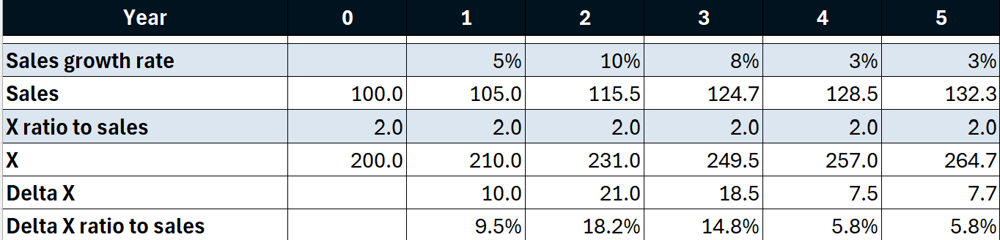
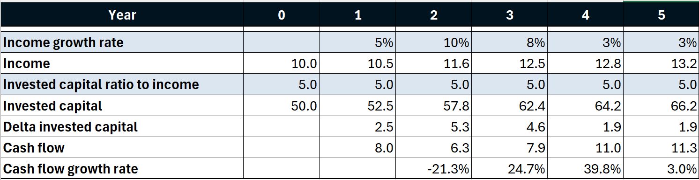

## From Makers to Checkers {.quote-slide}

:::{.quote-text}
What we're working towards is that every employee will have their own personalized AI assistant; every process is powered by AI agents, and every client experience has an AI concierge.

Workers would shift from being creators of reports or software updates, or 'makers' ... to ['"checkers" or managers of AI agents']{.amber} doing that work.
:::

:::{.quote-source}
Derek Waldron, JP Morgan Chief Analytics Officer — CNBC interview, September 30, 2025
:::

## The Maker

AI as maker is a [fast, tireless junior analyst]{.amber} that handles the mechanical work.

:::{.two-cards}
:::{.card .card-light}
[**What AI Does Well**]{.card-title}

- Drafts reports, memos, and summaries
- Wrangles and merges data from multiple sources
- Builds spreadsheets with live formulas
- Runs calculations and generates charts
- Formats output to a professional standard
:::

:::{.card .card-light}
[**The Speed Advantage**]{.card-title}

- Tasks that take hours become minutes
- No fatigue, no context-switching cost
- Runs the same workflow identically every time
- Frees you for judgment, relationships, and strategy
:::
:::

## The Checker

Your role shifts from doing the work to [directing and verifying]{.amber} it.

:::{.two-cards}
:::{.card .card-light}
[**Directing**]{.card-title}

- Specify the task clearly
- Provide the right inputs and context
- Define what "good output" looks like
- Decide when to iterate vs. accept
:::

:::{.card .card-light}
[**Verifying**]{.card-title}

- Spot-check key numbers against known sources
- Confirm the logic matches the business question
- Review edge cases and assumptions
- Sign off before the output goes anywhere consequential
:::
:::

:::{.explainer style="text-align:center;"}
The checker adds the judgment the maker lacks. [Neither alone is enough.]{.amber}
:::

## Where AI Can Silently Fail {.section-divider}

## Silent Analytical Errors

AI in code-execution mode rarely invents facts outright. Instead it makes [silent analytical errors]{.amber} --- mistakes that look fine on the surface.

:::{.two-cards}
:::{.card .card-light}
[**Common Failure Modes**]{.card-title}

- Filters slightly off (wrong date range, wrong column)
- Missing data dropped without warning
- Aggregation in the wrong order
- Misread assumptions from an ambiguous prompt
- Made-up citations or statistics in prose
:::

:::{.card .card-light}
[**Why They're Dangerous**]{.card-title}

- Output looks polished and professional
- Charts render cleanly --- nobody questions a clean chart
- Errors compound silently in multi-step workflows
- [Confidence without verification is the real risk]{.amber}
:::
:::

## The Checker's Toolkit

You don't need to re-do the work. You need [targeted verification]{.amber}.

- **Spot-check with known answers** --- run a simplified version of the calculation by hand on one or two rows
- **Ask Claude to explain its logic** --- *"Walk me through how you computed this number"*
- **Review the code** --- ask Claude to show the key filter and aggregation steps
- **Test edge cases** --- what happens with zeros, negatives, or missing values?
- **Sanity-check the magnitude** --- does the answer make sense given what you know?

:::{.explainer style="text-align:center;"}
Pick the checks that match the [stakes]{.amber}. A quick directional analysis needs less verification than a client deliverable.
:::

## Packaging the Maker as a Skill {.section-divider}

## Why Build a Skill?

Once you have a workflow that works and passes your checks, turn it into a [skill]{.amber} --- a reusable, one-command process.

:::{.two-cards}
:::{.card .card-light}
[**Without a Skill**]{.card-title}

- Re-type or copy-paste the same prompt each time
- Risk of drift --- slightly different wording, slightly different output
- Others on your team can't easily reuse your work
:::

:::{.card .card-light}
[**With a Skill**]{.card-title}

- One `/command` runs the full workflow
- Same logic, same checks, same output format every time
- Shareable --- drop it in a shared `skills/` folder
:::
:::

:::{.explainer style="text-align:center;"}
A skill is how a [one-time workflow]{.amber} becomes a [team asset]{.amber}.
:::

## Building a Skill with /skill-creator

1. Type `/skill-creator` to start the skill builder
2. Describe the workflow: inputs, steps, outputs, and any checks to include
3. Claude generates a `SKILL.md` and installs it in `~/.claude/skills/`
4. Invoke it anytime with `/skill-name`

:::{.explainer style="text-align:center;"}
You can embed checker steps directly in the skill --- for example, *"after computing the result, show the row count and the min/max values so the user can sanity-check the data."*
:::

## Valuing Companies {.section-divider}

## Valuation by Multiples

Compare the target company to [similar public companies]{.amber} on industry and size, then apply their valuation multiples.

:::{.two-cards}
:::{.card .card-light}
[**Finding Comparables**]{.card-title}

- Match on **industry** (same SIC code or GICS sector)
- Match on **size** (revenue, market cap, or total assets)
- The closer the match, the more reliable the multiple
:::

:::{.card .card-light}
[**Common Multiples**]{.card-title}

- **P/E** --- price to earnings; most widely used
- **P/S** --- price to sales; useful when earnings are negative
- **P/B** --- price to book; common in financial firms
:::
:::

:::{.explainer style="text-align:center;"}
For full automation, [connect the agent to a database]{.amber} of public company financials --- it can pull comparables, compute medians, and apply multiples in one step.
:::

## Two-Stage DCF Analysis

Discount projected cash flows back to the present. Two stages handle near-term uncertainty and long-run stability separately.

:::{.two-cards}
:::{.card .card-light}
[**Stage 1: Year-by-Year Forecasts**]{.card-title}

- Explicitly forecast each year (typically 5--10 years)
- Forecast [key financial ratios and growth rates]{.amber} 
- Example: forecast sales growth, then derive everything else in relation to sales
:::

:::{.card .card-light}
[**Stage 2: Terminal Value**]{.card-title}

- After the explicit forecast period, assume [constant growth]{.amber} forever
- Terminal value = final year cash flow × (1 + g) / (r − g)
- Often represents 60--80% of total value --- [the checker's most important number to scrutinize]{.amber}
:::
:::

## Gotcha 1

- It is reasonable to forecast balance sheet items in proportion to sales: receivables/sales, inventory/sales, net PP&E/sales, ...
- The change in a balance sheet item depends on the ratios in two successive years
- Outside of constant growth, [compute the change]{.amber} --- don't forecast it as a proportion of sales
- For cap ex: forecast net PP&E as a proportion of sales, forecast depreciation as a percent of net PP&E, [calculate cap ex as the plug]{.amber}

## Try It: The Ratio Approach

{width=80%}

## Gotcha 2

Because changes in balance sheet items depend on sales growth in two successive years, [first year of constant cash flow growth is second year of constant sales growth]{.amber}.

Add one year of constant sales growth to Stage 1. Make that year the terminal year.

## Gotcha 2 (continued)

{width=80%}

## Getting Started

Ask Claude Code:

*Build an example of a two-stage DCF model for a company. Forecast cash flows building up from forecasts of key financial ratios and growth rates.*

