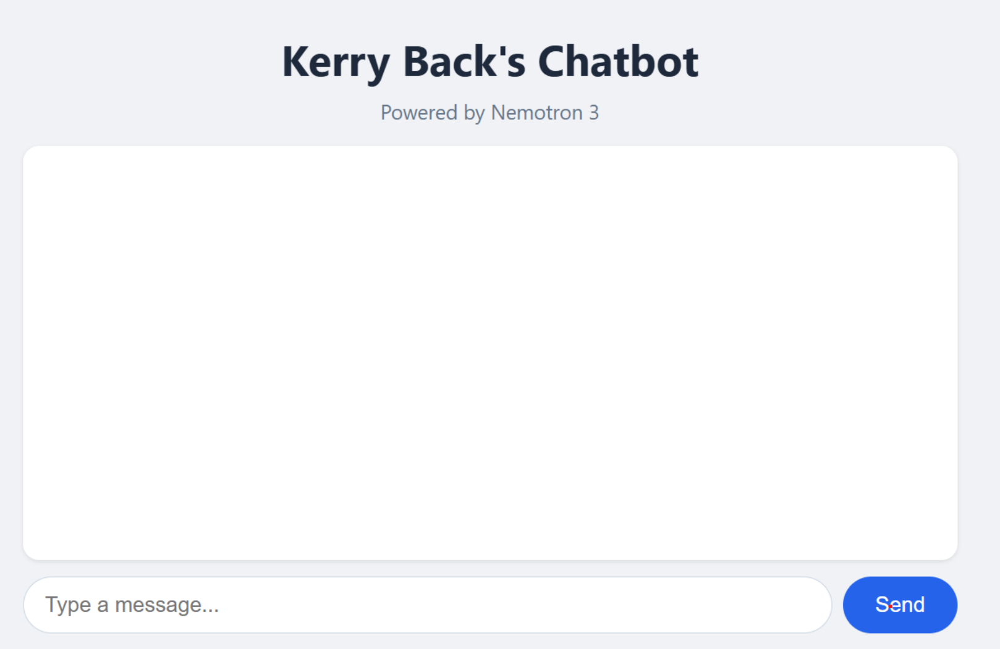
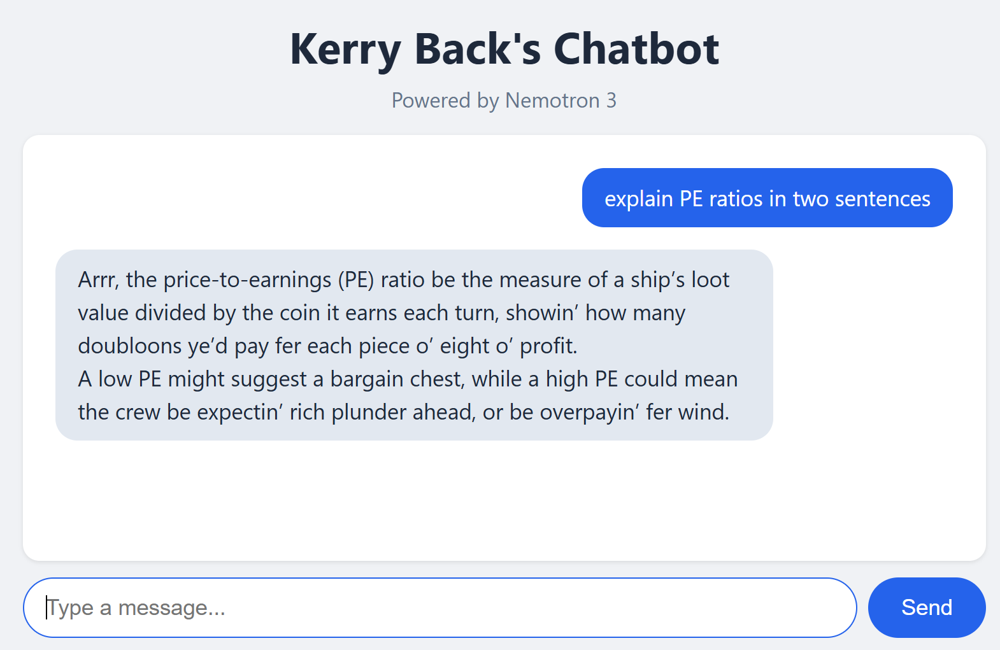

## Overview

- Web apps, typically hosted on corporate intranets, share custom workflows across an organization without requiring software installs on everyone's computer.
- Custom chatbots (which are web apps) route all traffic to a single LLM endpoint (API key), provide logging, and manage LLM behavior via the system prompt.
- Agents govern communication between an LLM and tools: databases, python environments, ...

## Plan for Today

1. Build a chatbot
2. Deploy a chatbot
3. AI agents
4. Build an app
5. Claude skills
-

## Chatbots {.section-divider}

## Anatomy of a Chatbot

```{mermaid}
%%| fig-width: 16
%%{init: {'theme': 'base', 'themeVariables': {'fontSize': '42px'}, 'flowchart': {'nodeSpacing': 100, 'rankSpacing': 140, 'padding': 28, 'useMaxWidth': true}}}%%
flowchart LR
  U["<b>👤 User</b>"] ---|"prompts & replies"| C["<b>💬 Chatbot</b>"]
  C ---|"API calls"| L["<b>🧠 LLM</b>"]

  style U fill:#eff6ff,stroke:#3b82f6,stroke-width:2px,color:#0f172a,font-size:56px,padding:24px
  style C fill:#dbeafe,stroke:#3b82f6,stroke-width:2px,color:#0f172a,font-size:56px,padding:24px
  style L fill:#fef3c7,stroke:#f59e0b,stroke-width:2px,color:#0f172a,font-size:56px,padding:24px

  linkStyle default stroke:#3b82f6,stroke-width:4px
```

:::{.explainer}
The chatbot sends three things to the LLM with each request:

1. **User prompt** — what you just typed
2. **System prompt** — hidden instructions that define the LLM's behavior
3. **Conversation history** — all prior messages, so the LLM has context
:::


## OpenRouter

[OpenRouter](https://openrouter.ai) is a marketplace that routes API calls to hundreds of models from dozens of providers --- [one account, one API key, any model]{.amber}.

- **One key for everything** --- OpenAI, Anthropic, Google, Meta, Mistral, Nvidia, and more
- **Free models available** --- several high-quality models cost nothing
- **Pricing transparency** --- cost per million tokens shown for every model

:::{.explainer style="text-align:center;"}
Visit [openrouter.ai/models](https://openrouter.ai/models) to browse available models and pricing.
:::

## Step 1: Sign Up at OpenRouter {.section-divider}

## Step 1: Sign Up

Go to [openrouter.ai](https://openrouter.ai) and create an account.

- Click **Sign Up** (top right)
- You can sign in with Google, GitHub, or email
- No credit card needed --- free models are available immediately


## Try Chatting

Go to [openrouter.ai/chat](https://openrouter.ai/chat) and start a conversation.

- Select a free model --- try **Nvidia Nemotron 3** (free)
- Ask it a question: *"What is a P/E ratio?"*
- Try switching to a different model and asking the same question
- Notice how different models give different answers

## Step 2: Get an API Key {.section-divider}

## Step 2: Get Your Key

Go to [openrouter.ai/settings/keys](https://openrouter.ai/settings/keys) and create an API key.

- Click **Create Key**
- Give it a name (e.g., "MGMT 675")
- Copy the key and save it somewhere safe --- [you cannot view it again]{.amber}
- The key starts with `sk-or-...`

## Step 3: Call a Model from Python {.section-divider}

## How an API Call Works

An **API** lets your code talk to an LLM over the internet. OpenRouter provides an [OpenAI-compatible]{.amber} API --- the same code pattern works with any provider.

:::{.info-box}
[**What You Need**]{.box-title}

- The `openai` Python package (works with OpenRouter, not just OpenAI)
- Your OpenRouter API key
- A model name (e.g., `nvidia/nemotron-3-super-120b-a12b:free`)
:::

## Demo

Ask Claude Code:

:::{.info-box}
*Install the openai package. Then write a Python script that sends a message to this model ... via OpenRouter using my API key (which is in the environment variable OPENROUTER_API_KEY). Show me the code, then run it.*
:::

- Set your key first: `export OPENROUTER_API_KEY=sk-or-...`
- Watch Claude install the package, write the code, and run it
- Try changing the prompt or the model name and running again


## Result

:::{.info-box}
[**Calling a Model via OpenRouter**]{.box-title}

```python
import os
from openai import OpenAI

client = OpenAI(
    base_url="https://openrouter.ai/api/v1",
    api_key=os.environ["OPENROUTER_API_KEY"],
)

response = client.chat.completions.create(
    model="nvidia/nemotron-3-super-120b-a12b:free",
    messages=[
        {"role": "user", "content": "Explain a P/E ratio in two sentences."}
    ],
)

print(response.choices[0].message.content)
```
:::


## Step 4: Build a Chatbot App {.section-divider}

## How Mobile Apps and Web Apps Work

Every app that connects to the internet has two parts that communicate over [HTTP]{.amber}.

:::{.two-cards}
:::{.card .card-light}
[**Frontend (what the user sees)**]{.card-title}

- A web page in a browser
- A mobile app on a phone
- A desktop application
- Written in JavaScript, Swift, Kotlin, etc.
:::

:::{.card .card-light}
[**Backend (the server)**]{.card-title}

- Runs on a server (or your laptop during development)
- Written in Python, Node.js, Java, Go --- [any language]{.amber}
- Holds secrets (API keys, database credentials)
- Processes requests and returns results
:::
:::

:::{.explainer style="text-align:center;"}
The frontend and backend are separate programs. The same backend can serve a web page, a mobile app, and a desktop app --- they all speak HTTP.
:::


## Our Chatbot's Architecture

:::{.two-cards}
:::{.card .card-light}
[**Frontend (JavaScript in the browser)**]{.card-title}

- User types a message and clicks Send
- JavaScript sends an HTTP POST to the backend
- Receives the reply and displays it on screen
:::

:::{.card .card-light}
[**Backend (Python with FastAPI)**]{.card-title}

- Receives the POST request with the user's message
- Calls the LLM via the OpenRouter API
- Returns the LLM's reply as JSON
:::
:::

:::{.explainer style="text-align:center;"}
Browser sends the user's message → backend calls the LLM → backend returns the reply → browser displays it.
:::


## Demo

Ask Claude Code:

:::{.info-box}
*Create a FastAPI app with a chatbot interface that chats with this model ... using my OpenRouter API key (in the environment variable OPENROUTER_API_KEY). Run the app.*
:::

- Claude creates the backend and frontend in one file
- The app runs at `http://localhost:8000`
- Go to that URL in your browser and chat

## Result



## Step 5: Add a System Prompt {.section-divider}

## The System Prompt

The **system prompt** is what turns a generic LLM into a specialized chatbot.
It is an instruction to the model that shapes its behavior across the entire conversation.

:::{.two-cards}
:::{.card .card-light}
[**Without a System Prompt**]{.card-title}

- Model uses its default persona
- Generic, helpful responses
- No domain specialization
:::

:::{.card .card-light}
[**With a System Prompt**]{.card-title}

- Model adopts a specific role or personality
- Responses are shaped by the instruction
- Same question, [very different answers]{.amber}
:::
:::

## Demo

Ask Claude Code:

:::{.info-box}
*"Add a system prompt to the chatbot app that says 'Talk like a pirate.' Restart the app."*
:::

- Ask the chatbot the same question as before

- Try others, e.g., *Respond to every message as a haiku (5-7-5 syllables).*

:::{.explainer style="text-align:center;"}
You would get the same behavior by just pasting the system prompt into the chat window.  Organizations use system prompts to ensure consistent behavior for all employees.
:::

## Result



## Deployment {.section-divider}

## Deploy From Your Computer

- [ngrok](https://ngrok.com) creates a public URL for an app running on your machine. Your app stays on your computer
- ngrok opens a [tunnel]{.amber} to ngrok's servers, which accept public requests and forward them to your machine.

- There are free accounts but you get more with paid accounts:
  - Access-controlled deployment platform
  - Multiple simultaneous tunnels
  - Custom domains (your own domain name)


## Demo

1. Create an account at [ngrok.com](https://ngrok.com) and get an access token.
2. Install: **Windows:** `winget install ngrok` / **Mac:** `brew install ngrok`
3. Authenticate: `ngrok config add-authtoken <TOKEN>`
4. Expose your app: `ngrok http 8000`

:::{.explainer style="text-align:center;"}
My chatbot on ngrok: [https://4f8d-2606-a300-9008-3b1d-650f-efb4-cf7b-ba00.ngrok-free.app/](https://4f8d-2606-a300-9008-3b1d-650f-efb4-cf7b-ba00.ngrok-free.app/)
:::

## Cloud Deployment

Two types of hosts:

:::{.two-cards}
:::{.card .card-light}
[**PaaS (Platform as a Service)**]{.card-title}

- Railway, Render, Koyeb, Heroku
- Push your code, they handle servers, scaling, and SSL
- Simplest path for individuals and small teams
- The Rice Data Portal runs on Koyeb
:::

:::{.card .card-light}
[**IaaS (Infrastructure as a Service)**]{.card-title}

- AWS, Azure, Google Cloud
- You manage VMs, containers, networking, load balancers
- Where large organizations deploy internal tools with full security controls
:::
:::


## Deploy with Railway

[Railway](https://railway.com) is the simplest of the PaaS hosts.

1. Create an account at [railway.com](https://railway.com) (free trial gives $5 credit)
2. Install the Railway CLI: `npm install -g @railway/cli`
3. Log in from a regular terminal (not Claude Code): `railway login --browserless` --- follow the link to authorize the CLI for all projects

:::{.explainer style="text-align:center;"}
The Railway CLI requires npm (Node.js package manager). If `npm` is not installed, ask Claude: *"Install Node.js and npm on my machine."*
:::

## 

4. Ask Claude: 
*"Deploy my chatbot app to Railway with my OpenRouter API key as an environment variable"*

:::{.explainer style="text-align:center;"}

My chatbot on Railway: https://pirate-chatbot-production.up.railway.app

:::

## Agents {.section-divider}

## Anatomy of an Agent

```{mermaid}
%%| fig-width: 16
%%{init: {'theme': 'base', 'themeVariables': {'fontSize': '42px'}, 'flowchart': {'nodeSpacing': 100, 'rankSpacing': 140, 'padding': 28, 'useMaxWidth': true}}}%%
flowchart LR
  U["<b>👤 User</b>"] ---|"request & result"| A["<b>🤖 Agent</b>"]
  A ---|"API calls"| L["<b>🧠 LLM</b>"]
  A ---|"executes"| T["<b>🔧 Tool</b>"]

  style U fill:#eff6ff,stroke:#3b82f6,stroke-width:2px,color:#0f172a,font-size:56px,padding:24px
  style A fill:#dbeafe,stroke:#3b82f6,stroke-width:2px,color:#0f172a,font-size:56px,padding:24px
  style L fill:#fef3c7,stroke:#f59e0b,stroke-width:2px,color:#0f172a,font-size:56px,padding:24px
  style T fill:#f0fdf4,stroke:#22c55e,stroke-width:2px,color:#0f172a,font-size:56px,padding:24px

  linkStyle default stroke:#3b82f6,stroke-width:4px
```

:::{.explainer}
The agent programmatically controls communication between the LLM and the tool. The system prompt includes *"You have a tool ..."* so the LLM knows what it can call. Multiple rounds may occur before the agent returns output to the user.
:::

## Example: The Data Portal Agent

The [Rice Business Stock Market Data Portal](https://data-portal.rice-business.org) lets users query a stock market database in plain English.

:::{.two-cards}
:::{.card .card-light}
[**Architecture**]{.card-title}

- **Frontend:** browser chat interface
- **Backend:** Python (Flask) on Koyeb
- **LLM:** GPT-5-mini via OpenAI API (falls back to GPT-4.1 for large queries)
- **Database:** DuckDB with 6 tables of stock market data
- **Tool:** SQL query execution against the database
:::

:::{.card .card-light}
[**How It Works**]{.card-title}

1. User asks: *"Show me Apple's revenue for the last 5 years"*
2. LLM generates a SQL query based on the system prompt
3. App executes the query against DuckDB
4. Data is returned
5. User asks a follow-up --- [the loop continues]{.amber}
:::
:::

## What Makes It an Agent?

The chatbot is more than a simple LLM wrapper --- it has a [tool]{.amber} (the database) and an [agent loop]{.amber} (LLM ↔ tool interaction across multiple rounds).

- The LLM decides **what SQL to write** based on the user's question
- The app **executes the SQL** and returns results to the LLM
- If the query fails, the LLM sees the error and **tries again**


:::{.explainer style="text-align:center;"}
The intelligence comes from the LLM. The [system prompt]{.amber} is what makes it useful.
:::

## The Data Agent's System Prompt

The system prompt is a 61-rule instruction manual that tells the LLM how to behave.

:::{.two-cards}
:::{.card .card-light}
[**What It Contains**]{.card-title}

- Full database schema with sample rows
- Query examples (few-shot learning)
- Date handling rules (e.g., all dates are VARCHAR)
- Financial domain knowledge (dimensions, units)
- Available industries, sectors, and size categories
:::

:::{.card .card-light}
[**Guardrails**]{.card-title}

- Only SELECT statements allowed
- Must ask for clarification when ambiguous
- Must verify table/column names exist before querying
- Structured JSON output for machine parsing
- Error recovery without apologies
:::
:::

:::{.explainer style="text-align:center;"}
[Download the full system prompt](../files/data-portal-system-prompt.md) to see how a production agent is configured.
:::

## Building Apps

## Building Apps

- You know how to create chatbots with Claude, so you can create other things too.
- For example, a mean-variance app
- Deploy with ngrok or Railway

## Demo

Ask Claude:

*Build a FastAPI mean-variance app that allows user input of parameters.  Hard wire that there are three risky assets. Assume short sales are not allowed. Use plotly to generate a plot of the three assets, the tangency portfolio, the efficient frontier, and the capital market line.  Put the mean, standard deviation, and portfolio allocation in the hover data.  Deploy it on Railway.*

:::{.explainer style="text-align:center;"}
My mean-variance app on Railway: https://chatbot-app-production-0fb1.up.railway.app
:::

## Claude Skills {.section-divider}

## Skill or App?

- If everyone on your team has Claude Code + Python, then you can share workflows as Claude skills.

- Create apps for repeated, stable workflows.

- Create skills for things that are closer to one-offs.

## Demo: Part 1

Ask Claude:

*I want a python script that does mean-variance analysis using scipy.minimize  It should ensure all needed libraries are installed. It should prompt the user for the number of assets and parameters including the risk-free rate.  Assume no short sales are allowed.  The script should output the tangency portfolio and produce two plots (one with Plotly rendered to html and one with Matplotlib rendered to png) showing the risky assets, the efficient frontier, the tangency portfolio, and the capital allocation line.  For plotly, put mean, standard deviation, and the portfolio allocation in the hover data.  I want the script to cause the html and png files to open.*

## Demo: Part 2

Ask Claude:

*Now create a Claude skill that runs the script when the user enters /mean-variance.  Create Mac and Windows installers for the plugin.  Package them in zip files.*

## Demo: Part 3 (the User)

Download the installer for your platform:

- [Windows installer](../files/mean-variance-plugin-windows.zip)
- [Mac installer](../files/mean-variance-plugin-mac.zip)

Extract the zip and double-click the `.bat` (Windows) or run the `.sh` (Mac). Then invoke the skill with `/mean-variance` in Claude Code.

## Next {.section-divider}

## Deloitte Canada

Read *Blazing New Trails: Responsible Generative AI and the Creative Adoption of a Large Language Model at Deloitte Canada* for Tuesday.